# Gazebo practical work
This project provides hands-on experience with ROS 2 and the Gazebo simulator.

### Requirements

Having a recent ubuntu version with docker installed ([installation guide](https://docs.docker.com/engine/install/ubuntu/)).

Then, pull the docker image containing ros2 humble and gazebo fortress

```bash
docker pull ghcr.io/sloretz/ros:humble-simulation
docker pull ghcr.io/ros-navigation/nav2_docker:humble-nightly
```

## Practical work: Part 1 *(60 min)*

### Included packages

* `ros_gz_example_description` - holds the sdf description of the simulated system and any other assets.

* `ros_gz_example_gazebo` - holds gazebo specific code and configurations. Namely this is where systems end up.

* `ros_gz_example_application` - holds ros2 specific code and configurations.

* `ros_gz_example_bringup` - holds launch files and high level utilities.

### Installations

1. git clone this project and checkout the branch `simplified_gazebo_practical_work`

   ```bash
   git clone https://github.com/kbInria/gazebo_practical_work.git
   ```

1. Allow docker to connect to the X11 server (for the GUI)

   ```bash
   xhost +local:docker
   ```

1. Run the docker image **in the folder containing the clone of this repository**

    ```bash
    docker run -it --rm --name="gazebo_simulator" --volume="/tmp/.X11-unix:/tmp/.X11-unix:rw" --volume="./gazebo_practical_work:/opt/catkin_ws/src:rw" --env="DISPLAY" -e XDG_RUNTIME_DIR=$XDG_RUNTIME_DIR --gpus all --device=/dev/dri ghcr.io/sloretz/ros:humble-simulation bash
    ```

1. If it is the first run, install and build as follow. You source `/opt/ros/humble/setup.bash` to set up your shell environment so it knows where ROS 2 is installed and how to find its tools, libraries, and packages.

    ```bash
    apt update && apt install -y vim ros-humble-rviz2 ros-humble-joint-state-publisher-gui evince
    cd /opt/catkin_ws
    source /opt/ros/humble/setup.bash
    colcon build --cmake-args -DBUILD_TESTING=ON
    source /opt/catkin_ws/install/setup.sh
    ```

    and in another terminal

    ```
    docker commit gazebo_simulator ghcr.io/sloretz/ros:humble-simulation
    ```

1. Run the following simulation to check the installations

    ```bash
    ros2 launch ros_gz_example_bringup diff_drive.launch.py
    ```

**Note:** You can always open a new bash session to the docker image by running in another terminal


```bash
docker exec -it gazebo_simulator bash
```

### Reminders

#### Docker

**Docker** is an OS‑level virtualization (or containerization) platform, which allows applications to share the host OS kernel instead of running a separate guest OS like in traditional virtualization.\
This design makes Docker containers lightweight, fast, and portable, while keeping them isolated from one another.

#### ROS2

- a **node** should be responsible for a single, modular purpose, e.g. controlling the wheel motors or publishing the sensor data from a laser range-finder. Each node can send and receive data from other nodes via topics, services, actions, or parameters.
- a **topic** acts as a bus for nodes to exchange messages. A node may publish data to any number of topics and simultaneously have subscriptions to any number of topics. (asynchronous)
- a **service** is another method of communication for nodes in the ROS graph. Services are based on a call-and-response model versus the publisher-subscriber model of topics. (synchronous)


### Gazebo UI

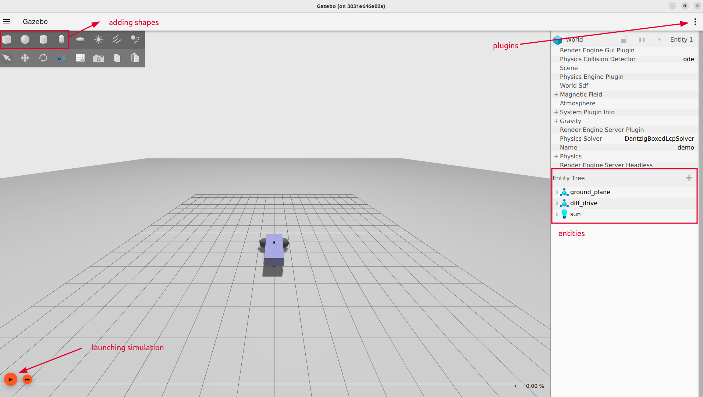

### Rviz UI

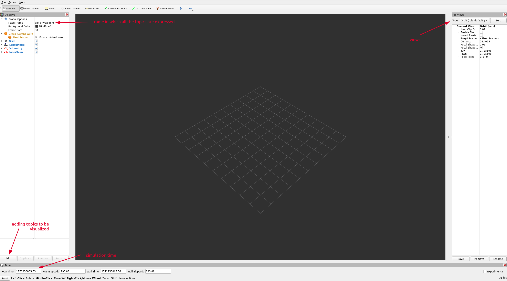

### Communication between gazebo and rviz

1. Check in `ros_gz_example_description/models/diff_drive/model.sdf` on which topic the sensor scan will be published.
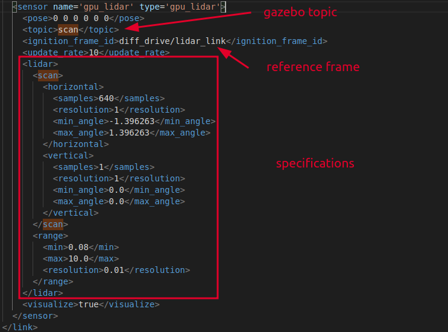

1. Check all the available gazebo topics `ign topic -e -t /scan` and then listen to the scan topic `ign topic -e -t /scan`.

1. Check in `ros_gz_example_bringup/config/ros_gz_example_bridge.yaml` how the scan topic is being bridged to ros.

1. Check all the available gazebo topics `ros2 topic list` and then listen to the scan topic `ros2 topic echo /diff_drive/scan`.

### Sensor visualization

1. Launch the simulation

1. Add a shape in front of the robot

1. Check the changes in rviz


NOTE: in the `Laserscan` tag in rviz, you can change the visualization options of the laser scan


### Sending speed command

1. Check all the available gazebo topics `ros2 topic list` and then listen to the scan topic `ros2 topic echo /diff_drive/cmd_vel`.

2. Check the topic message type `ros2 topic info /diff_drive/cmd_vel` and then find how it is bridge in `ros_gz_example_bringup/config/ros_gz_example_bridge.yaml`. In which direction is the bridge?

3. Send the following speed command to the robot and see what happen in rviz and gazebo:

```bash
ros2 topic pub --once /diff_drive/cmd_vel geometry_msgs/msg/Twist "{linear: {x: 2.0, y: 0.0, z: 0.0}, angular: {x: 0.0, y: 0.0, z: 1.8}}"
```

4. What is changing in rviz?


> The robot in this simulation is called a differential drive wheeled robot. \
> It is a robot whose movement is based on two separately driven wheels placed on either side of the robot body. \
> It can be controlled by varying the relative rate of rotation of its wheel. \
> In our case, we are using a differentail drive driver so that we can directly feed it
> a linear and angular velocity commands (more human readable)
>
> 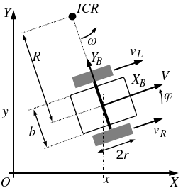


### TFs

1. Add the `TF` topic in RVIZ

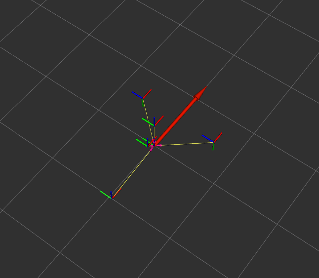

2. Run the following command and then visualize the resulting pdf using evince:

```bash
ros2 run tf2_tools view_frames
```
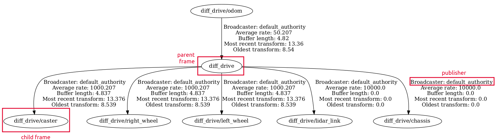

3. Check in `ros_gz_example_description/models/diff_drive/model.sdf` how the TFs are defined.

> A **Transform** can be understand as: **where is an object with respect to another?**\
> It can be **static** (transform between a fixed object and the world) or **dynamic** (pose of a robot in the world).\
> ROS uses a framework called TFs that allows to get the relative pose of an object with respect to another easily and at any point of time.\
> In the terminal, type `ros2 topic echo /tf`. What do you see?\
> When designing a robot, you need to think which are the element of the robot that require a tf? \
> In the following image, why did we place the tfs there?\
> 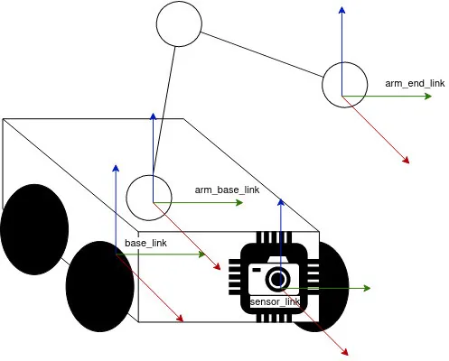


<!-- Maybe add here the demo with joints https://control.ros.org/master/doc/ros2_control_demos/doc/index.html#using-docker -->


## Practical work: [Navigation](https://docs.nav2.org/getting_started/index.html#navigating) *(60 min)*

### Installations

1. Run the following docker image:

```bash
    docker run --gpus all -it --rm --name="nav2_humble" --ipc=host --net=host --privileged -e DISPLAY=$DISPLAY -v /tmp/.X11-unix:/tmp/.X11-unix -e NVIDIA_DRIVER_CAPABILITIES=all ghcr.io/ros-navigation/nav2_docker:humble-nightly bash
```

2. Install in the docker container:
```bash
    apt update && apt install -y ros-humble-nav2-bringup  ros-humble-turtlebot3* ros-humble-slam-toolbox  evince feh
    export TURTLEBOT3_MODEL=waffle
    export GAZEBO_MODEL_PATH=$GAZEBO_MODEL_PATH:/opt/ros/humble/share/turtlebot3_gazebo/models # Iron and older only with Gazebo Classic
    source /opt/ros/humble/setup.bash 
```

3. In another terminal

```bash
    docker commit nav2_humble ghcr.io/ros-navigation/nav2_docker:humble-nightly
```

### Overview

1. Run the launch command:
```bash
    ros2 launch nav2_bringup tb3_simulation_launch.py headless:=False
```

NOTE: it can take some time before gazebo is fully loaded. If it is too slow or the turtlebot is not present in gazebo, run the command with `headless:=True` and then run in another terminal `gzclient`

2. Check the tf tree 
```bash
    ros2 run tf2_tools view_frames
```

3. Now send a pose estimate where you think the robot is and check the tf tree again. What has changed?

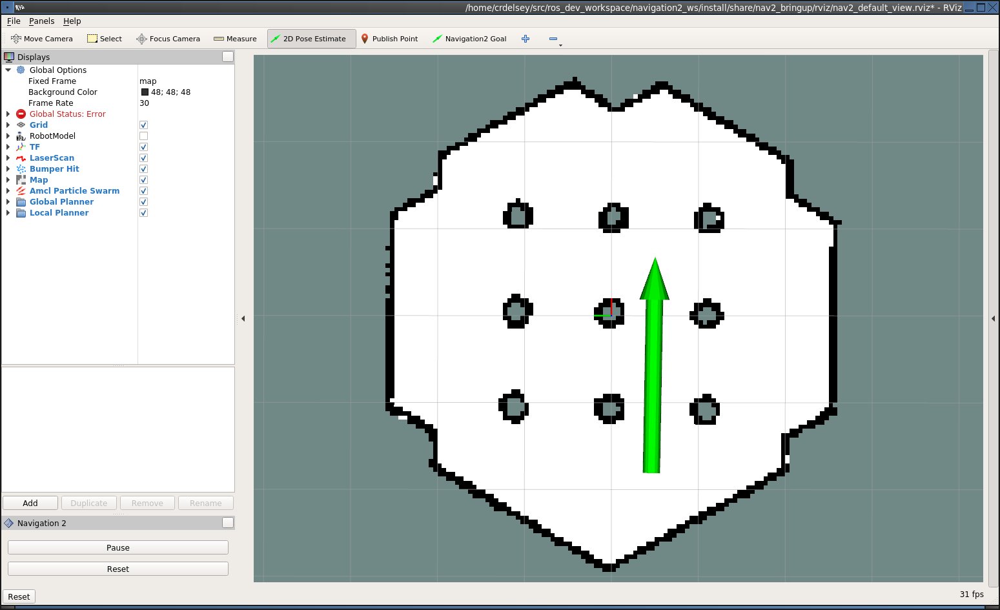

4. Send a nav goal to the robot. What happen?

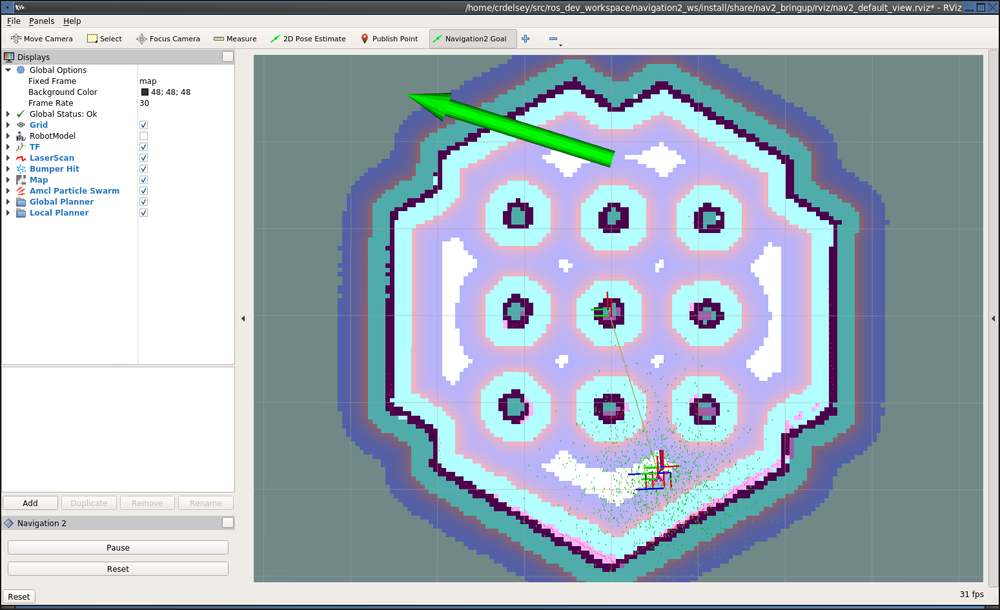

5. Now send a pose estimate **not quite** where you think the robot is and then a nav goal? What happen?


> To navigate a known environment, a robot need the following components:
>
> **State estimation**: provide an accurate position of the robot on the map using sensor fusion and other techniques.\
> **Path planning**: We usually differentiate them in two types: **global** planners that use the a priori knowledge of the environment (static) to compute a path and **local** planners that adjust to the current changes of the environment (dynamic).\
> **Path following**: once the path has been computed and adjusted, a controller is dedicated to make the robot follow it.\
> 
>
> Many other software components can be used depending on the difficulties of the scenario: **specific behavior controller** (charging a robot to a docker station, use a tool, etc...), **path smoother** (to ensure optimal and feasable paths), **collision checker** (fast detector which triggers safety stop), **recovery behaviors** (couple to a decision tree / state machine to decide what to do) 
>
> 
> 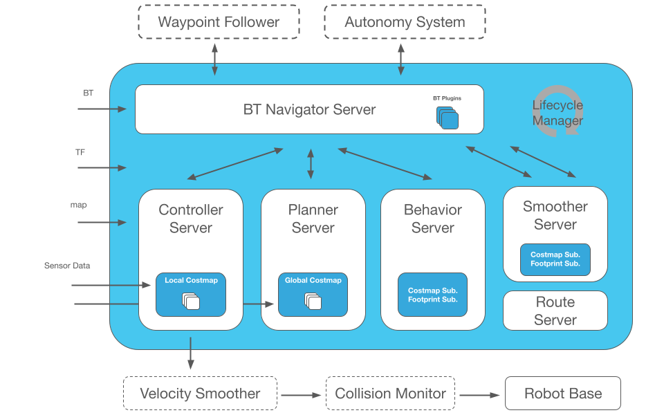


### SLAM

1. After stopping the previous launch, launch the following:

```bash
ros2 launch nav2_bringup tb3_simulation_launch.py headless:=True slam:=True
```

In the RVIZ visualization, disable the controller folder.

2. Send a nav2 goal far from the current map. What happen?

3. Send a nav3 goal inside the current map and close to the turtlebot. What happen?

4. Try to explore the entire map until you find it sufficiently detailled. Then run the following command:
```bash
ros2 run nav2_map_server map_saver_cli -f ~/map
```

And check the result by doing `feh ~/map.pgm`

> To help with robotics developers to understand each other, ROS came up with conventions. One of them define how the [generic tf tree](https://www.ros.org/reps/rep-0105.html) of a robot should look like.
>
> 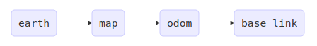
>
> When using mapping/localization and odometry, here is how the tfs are published:
>
> 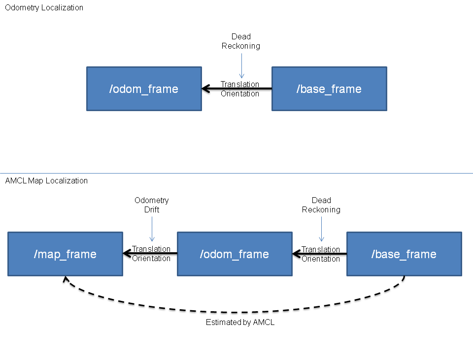
>
> **Odometry**: provide a smooth and continuous local frame based estimation of the robot position using the robot motion.\
> **Global Localization**: provide an accurate position of the robot on a map.\

